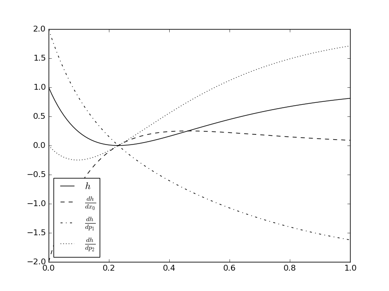

=============================================================================================
integration of ODEs + derivatives (directional and adjoint)
=============================================================================================

Description
-----------

    INDegrator is a library of IND integration schemes.

    They allow you to evaluate the solution :math:`x(t; x_0, p, q)` of initial value
    problems (IVP) of the form

    .. math::

        \dot x =& f(x, p, q) \\
        x(0) =& x_0

    where :math:`\dot x` denotes the derivative of :math:`x` w.r.t. :math:`t`,
    and additionally

    * first-order derivatives

      .. math::

        \frac{\partial x}{\partial (x_0, p, q)}(t; x_0, p, q) \;, \\

    * and second-order derivatives of the solution

      .. math::

        \frac{\partial^2 x}{\partial (x_0, p, q)^2}(t; x_0, p, q)
      
    in an accurate and efficient way.

    The derivatives w.r.t. :math:`x_0`, :math:`p` and :math:`q` are computed based on the IND and automatic differentiation (AD)
    principles. Both forward and reverse/adjoint mode computations are supported.

Rationale
---------

    * For optimal control (direct approach) one requires accurate derivatives of the solution w.r.t. controls ``q``.

    * For least-squares parameter estimation algorithms one requires derivatives of the solution w.r.t. parameters ``p``.

    * For experimental design optimization one requires accurate second-order derivatives of the solution w.r.t. ``p`` and ``q``

Features
--------

    * Explicit Euler, fixed stepsize

         - first-order forward
         - second-order forward
         - first-order reverse

    * Runge Kutta 4 (RK4), fixed stepsize

         - first-order forward
         - second-order forward
         - first-order reverse

Example
-------

Consider the initial value problem

.. math::

    \dot x =& p_1(x - p_2) \\
    x(0) =& x_0

and the model response function 

.. math::

    h(t, x, p, u)  = (x(t) - p_1)^2 \;.

We would like to compute the derivatives

.. math::

    \frac{\partial h}{\partial x_0}(t_i, x(t_i; x_0, p, q), p, u) \\
    \frac{\partial h}{\partial p}(t_i, x(t_i; x_0, p, q), p, u)

for :math:`t_i = \frac{i}{99}, i=0,\dots,99`, :math:`x_0=2`, :math:`p=(3,4)`. The following code shows how to setup this task with MSOBox.

.. literalinclude:: ../examples/ind.py
   :language: python
   :lines: 1-1000

